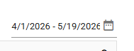
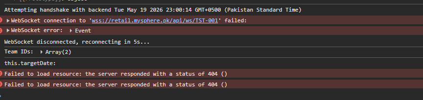
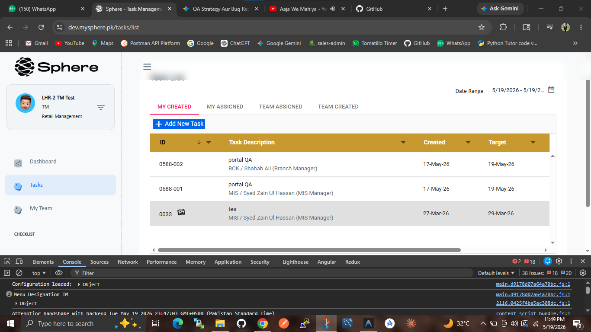
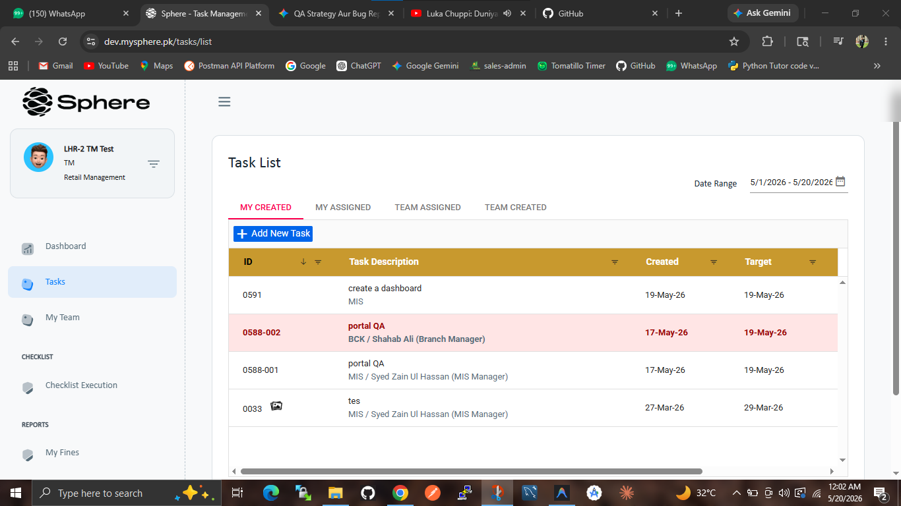

Sphere Web App Testings

Task List Module

https://dev.mysphere.pk/tasks/list

ADMIN LOGIN

> Search Bar testing :
> [Pass] Search Functionality

- Test 1 : Exact match "portal QA" on filtering
- Test 2 : Case - Sensitivity matches whether you write PORTAL or  
  portal.
- Test 3 : Partial ID : Numeric values like 0588 also filters tasks

> Date Range
> [PASS] Date Range Filter

- Date Range Custom : works fine
- Date selection - Today : works fine
- Date selection - Yesterday : works fine
- Date selection - this week : works fine
-
- Date selection Last month : why last month ends select current
  month date ????  
  
- Date selection this month : works fine
- Date selection last year : not working whether its data not
  available.

MIS Manager login

> Websocket connection
 [Fail] Web socket not connected

> Create Task
> [FAIL] Task Creation with Image Upload

- Create task with jpeg , png failed within 2mb
- Click on Save button , first image uplaod failed , no task created
  with any type of image like jpeg , png

> create task without image
> [Pass] Task creation without image

- Create task without image upload pass.

> Target date in create task

- target date in create task remain the same whether you create how many you created
  like first it is 2 days ahead when you select custom target date it will remain same
  whether you create many tasks aur login within admin , manager , retal manager

Retail Management Login

> Date Range
> [Fail] Task Date range fail
> 

- date selected today the why march date appear in in the task list

> Reset Button in Task list

- reset button in Task list does not work.

> Date Range is not working in Retail Management login
> [fail] Date Range

- date range : not working in retail management login properly.
  
